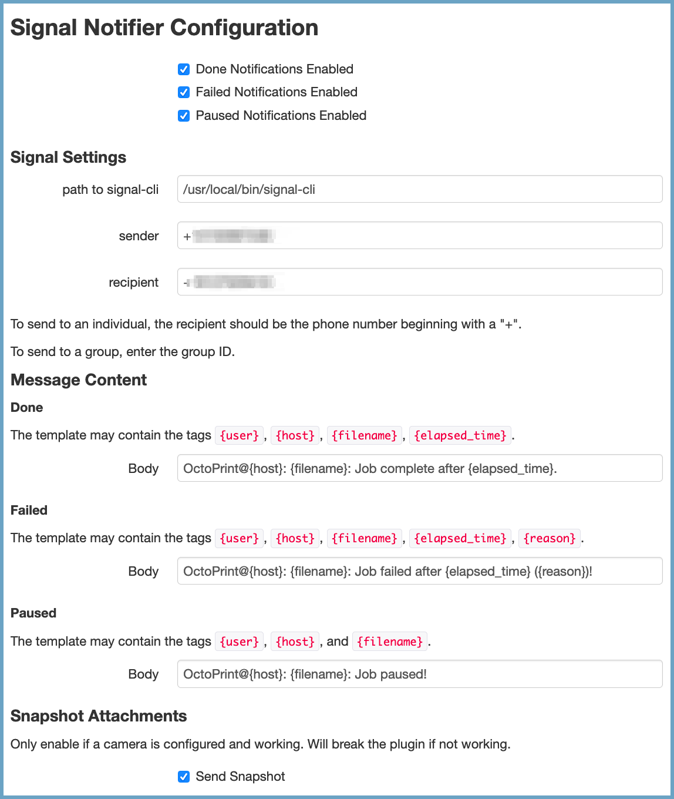

# OctoPrint_Signal-Notifier

Recieve Signal (https://signal.org/) messages when OctoPrint jobs are complete.

## Setup

Install via the bundled [Plugin Manager](https://github.com/foosel/OctoPrint/wiki/Plugin:-Plugin-Manager)
or manually using this URL:

    https://github.com/aerickson/OctoPrint_Signal-Notifier/archive/master.zip

## Configuration

Ensure that signal-cli (https://github.com/AsamK/signal-cli) is installed and working on the host.

## Acknowledgements

Loosely based on [OctoPrint_FreeMobile-Notifier](https://github.com/Pinaute/OctoPrint_FreeMobile-Notifier)

## License

Licensed under the terms of the [AGPLv3](http://opensource.org/licenses/AGPL-3.0).
